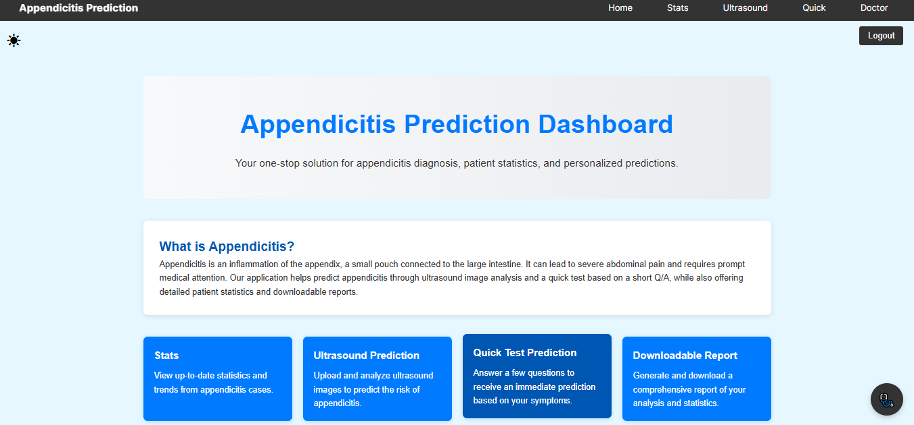
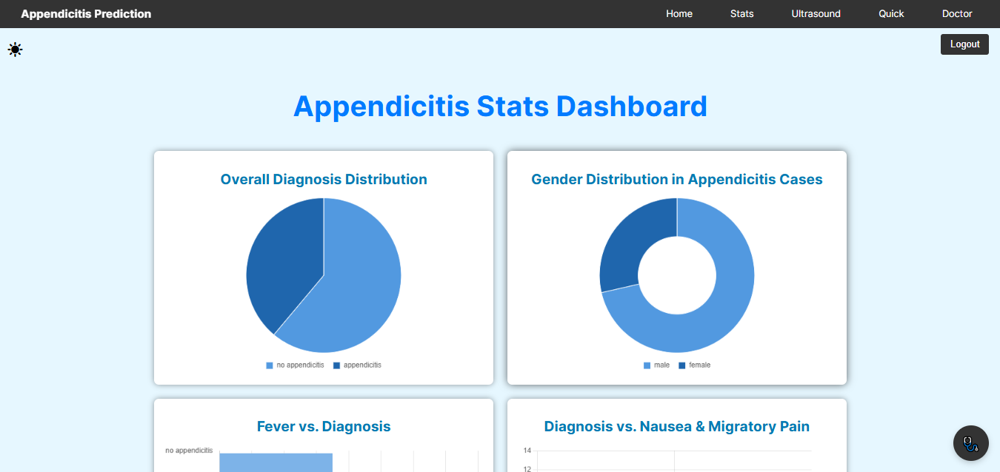
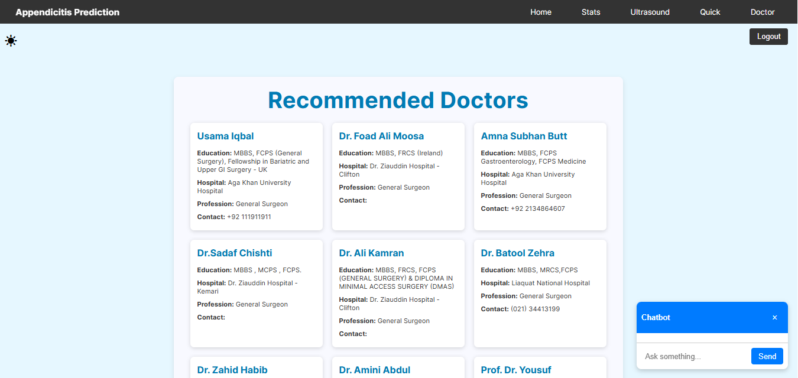
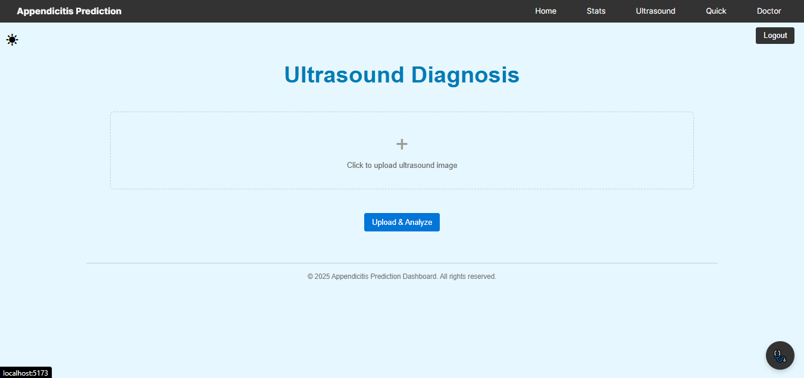
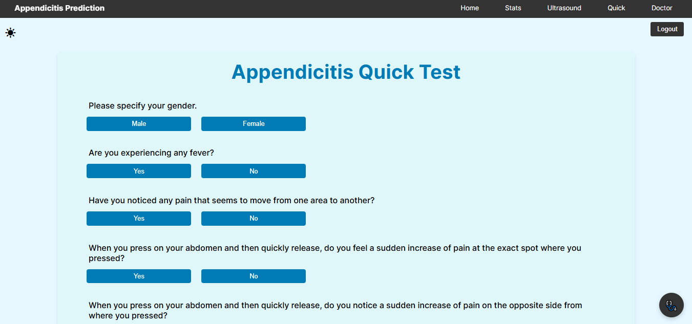

# 🏥 Appendicitis Prediction App


## 📌 Project Overview
**Appendicitis Prediction App** is an AI-powered medical assistant that helps users diagnose appendicitis using chat-based guidance, symptom-based tests, and ultrasound image analysis.

## ✨ Features
- 🔹 **Chatbot:** Powered by **LLaMA 3 (Groq API)** for instant medical guidance.
- 🔹 **Authentication:** Uses **Firebase** for secure login and user management.
- 🔹 **Database:** Stores user data, test results, and doctor recommendations in **Firestore**.
- 🔹 **Stats Dashboard:** Displays real-time appendicitis statistics from Firestore.
- 🔹 **Doctor Recommendations:** Provides doctor suggestions dynamically from Firestore.
- 🔹 **Diagnosis Options:**
  - **Quick Test:** Uses a **Decision Tree model** for symptom-based prediction.
  - **Ultrasound Analysis:** **YOLOv8** determines if the ultrasound image contains an appendix and detects appendicitis.
- 🔹 **Comprehensive Reports:**
  - Generates reports with **ReportLab**.
  - Users can **download reports as PDFs** or **share via Outlook**.

## 🏗️ Tech Stack
- **Frontend:** React
- **Backend:** FastAPI, Firebase (Auth & Firestore), Groq API (LLaMA 3)
- **Machine Learning:** Decision Tree, YOLOv8

## 🚀 Installation & Setup

### 1️⃣ Clone the Repository
```sh
git clone https://github.com/momina02/Appendicitis-Prediction-System.git
cd Appendicitis-Prediction-System
```

### 2️⃣ Install Backend Dependencies
```sh
cd backend
pip install -r requirements.txt
```

### 3️⃣ Install Frontend Dependencies
```sh
cd frontend
npm install
```

### 4️⃣ Set Up Firebase
- Create a Firebase project.
- Enable **Authentication** and **Firestore**.
- Download your `serviceAccountKey.json` and place it in the `backend` folder.

### 5️⃣ Run the Backend (FastAPI)
```sh
cd backend
uvicorn main:app --reload
```

### 6️⃣ Run the Frontend (React)
```sh
cd frontend
npm run dev
```

## 📸 Screenshots







## 🤖 AI Models Used
- **LLaMA 3 (Groq API):** For chatbot-based assistance.
- **Decision Tree Model:** For symptom-based appendicitis prediction.
- **YOLOv8:** For ultrasound image-based appendicitis detection.

## 🤝 Contributing
Pull requests are welcome! Feel free to improve the project or suggest new features.

---
🚀 *Made with ❤️ for medical AI innovation!*

